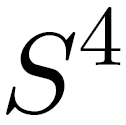

% S4
% Victor Liu (vkl@stanford.edu)
% Mar 30, 2013

[S4 Home](index.html) | [Download](download.html) | [FAQ](faq.html) | [Lua API](s4_lua_api.html) | [Developer information](dev_info.html) | [Changelog](changelog.html)

# Stanford Stratified Structure Solver

S4 is a frequency domain code to solve layered periodic structures.
Internally, it uses Rigorous Coupled Wave Analysis (RCWA; also called the Fourier Modal Method (FMM)) and the S-matrix algorithm. S4 was developed by Victor Liu of the Fan Group in the Stanford Electrical Engineering Department.

# Contents

* [Download](download.html)
* [Lua API (main documentation)](s4_lua_api.html)
* [FAQ](faq.html)
* [Developer information](dev_info.html)
* [Known issues](bugs.html)
* [Changelog](changelog.html)
* [Recommended settings](formulations.html)
* [Calculation utilities](calc.html)
* [License, Copyright, and Referencing](license.html)

# Program usage

The program may be run with a Lua script as an argument, in which case the script is run and then the program terminates, or without an argument, in which case it enters interactive mode with a Lua shell.

The basic flow of a script is listed below.

1. Obtain a new simulation object:
       S = S4.NewSimulation()
   S now contains a simulation object with a blank specification, and
   no solutions.
2. Define all materials:
       S:AddMaterial('name', {eps_real, eps_imag})
3. Add all layers:
       S:AddLayer('name', thickness, 'material_name')
4. Add patterning to layers:
       S:SetLayerPatternCircle('layer_name',
                               'inside_material',
                               {center_x, center_y},
                               radius)
5. Specify the excitation mechanism:
       S:SetExcitationPlanewave(
          {angle_phi, angle_theta}, -- phi in [0,180), theta in [0,360)
          {s_pol_amp, s_pol_phase}, -- phase in degrees
          {p_pol_amp, p_pol_phase})
6. Specify the operating frequency:
       S:SetFrequency(0.4)
7. Obtain desired output:
       forward_power, backward_power = S:GetPoyntingFlux('layer_name', z_offset)
       print(forward_power, backward_power)

# Feedback and contact

For support of the S4 package, contact the author Victor Liu (vkl@stanford.edu).
